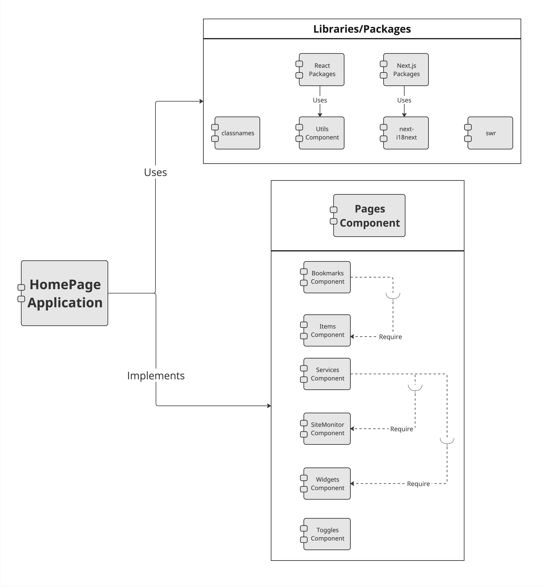
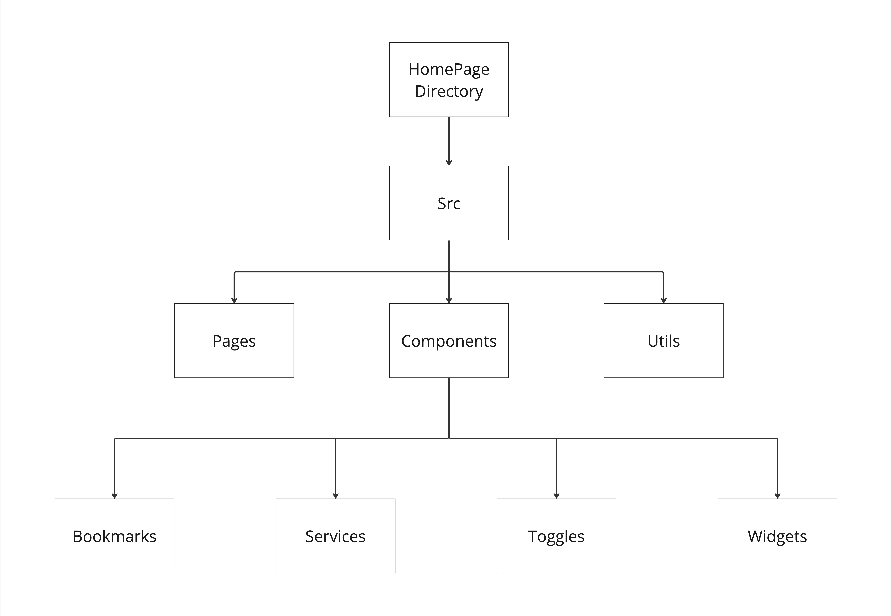

# INFO 443 AU 23 Project 2

#### Group Members
- Minh Mai
- Chun Hin Matthew So 
- Joseph Tran 
- Jerry Yan

**Forked Repo:** [Link](https://github.com/jknt27/homepage)

**Documentation:** [Link](https://gethomepage.dev/)

## I. About the Project/Context and Background

### Project Name: *HomePage*

**Authors:** shamoon and over 200 independent contributors

**Type:** React/Next.js Application

### Description:

*HomePage* is a robust React/Next.js application, leveraging technologies like React, Docker, and Node.js. It functions as a versatile dashboard, blending React's UI capabilities with Next.js's efficiency, enhanced by Docker and Node.js for robust backend support. Designed to be modern, fast, and secure, it offers a centralized platform for users to customize and access a wide array of features. These features include quick search capabilities, bookmark management, and real-time weather updates. The project was initially created by shamoon, with continuous contributions from a diverse community of over 200 independent contributors, making it the feature-rich and dynamic application it is today. Whether users are looking to streamline daily tasks, stay informed about the weather, or simply organize online activities, HomePage offers a seamless and personalized experience for users of all backgrounds and interests.

## II. Development View

### System Components

The following table below provides an overview of the primary components necessary for our application. Every component is in charge of a certain task and these all come together to create a functional system. These components are described in the table below by what they do and which dependencies they use.

| Component | Purpose | Dependencies |
| :-------: | ------- | ------------ |
| JavaScript Layer (_App.jsx & index.jsx) | Initializes the primary components and dependencies required to ensure all components can function properly. | React, Next.js | 
| Pages | Renders the primary "HomePage" UI and displays users' desired content. | _App.jsx, index.jsx, Bookmarks, Items, Services, SiteMonitor, Toggles, Widgets|
| Bookmarks | Allows users to set frequently used applications and links for quick access. They may view items as groups or as a list. | Items |
| Items | An individual piece of data or statistical information accessible by the user. | None |
| Services | Allows users to monitor various services of their choice. This could vary from monitoring their desired server's statistics or checking the status of their docker containers. | SiteMonitor, Widget |
| SiteMonitor | Acts similar to a `ping` command and checks the status of a server or site. | None |
| Toggles | These are similar to buttons that take the input of the user. This component changes the UI of the application based on the interaction with the user. There is a toggle for theme color, light, and dark mode, and to reload the page. | None |
| Utils | Contains smaller system utility services that are less commonly used by users. This also includes saving certain user settings such as themes and colors. Some utilities included are Calendar, Hooks, Kubernetes, Proxy, and Weather. | None |
| Widgets | Displays information regarding the current status of a desired system or basic information (such as time) | None|


*Table 1: Component Table with their purposes and dependencies.*

### UML Component Diagram

A hierarchical decomposition of system components is presented in Figure 1's constructed UML component diagram for the HomePage Application, exemplifying a modular architecture and encapsulation. The HomePage application itself is at the top of this hierarchy, and it is divided into two major components: the `Libraries/Packages` Component and the `Pages` Component.

The `Libraries/Packages` tier serves as a foundational layer, encapsulating the React and Next.js libraries alongside key dependencies such as `classnames`, `next-i18next`, and `swr`. This selection of libraries indicates a strong reliance on React's component-driven architecture, Next.js's enhanced features for server-side rendering and routing, as well as dynamic styling capabilities through `classnames`. Additionally, the inclusion of `next-i18next` makes the application accessible to those around the world by translating to supported languages, while `swr` plays a pivotal role in efficient data fetching, caching, and state management within the application. These libraries work together to enable scalable and feature-rich UI development and manipulation.

Within the `Pages Component`, a composite structure unfolds, comprising `Bookmarks`, `Items`, `Services`, `Site Monitor`, `Widgets`, and `Toggles` components. This layered approach manifests a clear dependency management strategy, where `Bookmarks` requisition `Items` for data representation, and `Services` necessitate `Site Monitor` and `Widgets` for functionality. This delineation underscores an architecture where high-level components are abstracted from low-level operations, fostering an environment conducive to independent component development and testing, as well as scalability through facile integration of additional features. The diagram thus reflects a contemporary approach to React development, privileging component reusability and compositionality.


*Figure 1: UML Component Diagram illustrating the modular structure and inter-component relationships within the HomePage Application.*

### Other System Dependencies

Table 2 summarizes the primary dependencies required by the Homepage components. These dependencies contribute to a better user experience by providing an amazing user interface with limitless features. The version numbers listed in Table 2 are the most recent versions in use at the time of writing. Note that these versions will continue to change as features are added/removed, bugs are fixed, and security vulnerabilities are patched, so please refer to their respective documentation for more information. 

| Dependency | Description | Current Version |
| ---------- | ----------- | :-------------: |
| React | The React package is primarily used to assist in the creation of UI components that change in response to updates. | 18.2.0 |
| React-Dom | The React-Dom package is primarily used with React components to interact with DOM elements. | 18.2.0 |
| Next | The Next package manages the server side of the React components. It serves as the application's foundation. | 12.3.1 |
| Next-il8next | The Next-il8next package is critical to our application's accessibility. It aids in the translation of components to supported languages, allowing users all over the world to easily understand and navigate the application. | 12.0.1 |
| SWR | The SWR package helps React components by efficiently handling and fetching data to ensure that data is correct and always up to date. | 1.3.0 |
| Classnames | The Classname package is used to join class names together. This is especially useful for the dynamic components. | 2.3.2 |
| Recharts | The Recharts package is primarily used to create visually appealing and interactive charts. | 2.7.2| 
| Pretty-bytes | The Pretty-bytes package is used to decipher computer bytes into human-readable text. | 6.0.0 |
| Winston | The Winston package creates logs for our application. | 3.8.2 |
| Ping | This sends ICMP requests to test the network connectivity of services. | 0.4.4 |

*Table 2: Primary System Dependencies.*

### High-Level Codeline Model

Figure 2 provides a high-level code line model of the HomePage within the src directory, emphasizing primary components like `Pages` and `Utils` with key subcomponents including `Bookmarks`, `Services`, `Toggles`, and `Widgets`. It illustrates the structural components of the application in a concise but comprehensive manner, enabling developers to understand the code structure and interactions. The separation of the codebase into core components improves navigation and adds to effective development methods.


*Figure 2: HomePage's High-Level Codeline Model.*

### Testing and Configuration

The HomePage GitHub repository lacks dedicated test files or a formal test suite. While the repository's documentation details its features, Docker integration, and development setup, there is no mention of testing methodologies or practices. In the absence of testing protocols, it would be beneficial to implement a testing framework like `Jest`. Unit tests for individual components can ensure functionality at the most granular level, while integration tests can verify the interactions between different parts of the application. Additionally, end-to-end tests can simulate real user scenarios, assuring that the application works as intended in a production-like environment. By incorporating these testing strategies, the application's overall quality and robustness can be substantially enhanced.

## III. Applied Perspective

### Introduction to Perspective

Usability as an architectural perspective emphasizes designing systems that are efficient, effective, and satisfying for the end user. It focuses on how user interactions with the system are designed and how easily users can accomplish their desired tasks. 

The usability perspective is especially relevant to the Homepage project, which is characterized as a highly customizable Homepage with Docker and service API integrations. This perspective ensures effective interaction with the system, catering not just to end-users but also to maintainers and support personnel. This project's focus on customization, integration with over 100 services, support for multiple languages, and a range of user-centric features such as quick search, bookmarks, and weather support makes it imperative to adopt a usability-focused architectural approach. This ensures that the diverse and feature-rich platform remains intuitive and efficient for all users, regardless of their technical background or preferences, prioritizing usability is vital to its success.

### Concerns with this Perspective

In Chapter 29 of "Software Systems Architecture," several usability concerns come to light that should be addressed for an effective system:

- _User Interface Usability_: It's critical to design a user interface that caters to a diverse range of users. This includes not only end users but also personnel involved in operations, maintenance, and support. The interface should be intuitive, reducing the learning curve and enhancing user satisfaction. Key considerations include layout clarity, interaction simplicity, and responsiveness.

- _Process Flow_: The system's process flow should be streamlined and user-centric, especially considering the complexity of integrations and functionalities. Simplified navigation through processes, along with ensuring their clarity and consistency, can significantly reduce user errors and improve overall efficiency.

- _Information Quality_: The value of Homepage is significantly influenced by the quality of the information it provides. Ensuring data accuracy, relevance, consistency, and timeliness is vital for building user trust and facilitating effective decision-making. Poor information quality can lead to user dissatisfaction and reduced system effectiveness.

- _Alignment with Work Practices_: The system's design must align seamlessly with the actual work practices and skill levels of its users. This alignment is essential for fostering user adoption and minimizing resistance. In cases where Homepage introduces new technologies or workflows, provisions for user training or adjustments in business processes might be necessary to ensure a smooth transition.

- _Impact of Other Perspectives_: It's equally important to take into account how other architectural perspectives, such as performance, scalability, and internationalization, can impact usability. For example, ensuring that Homepage performs efficiently across various devices and network conditions is crucial for a positive user experience. Additionally, accommodating different languages and cultural contexts enhances the platform's global usability, contributing to its overall effectiveness on a broader scale.

### Perspective Activities

In applying a usability perspective, the process begins with understanding the users. This means finding out what they need and prefer through surveys and studies. The information gathered is then used to create several versions of the design, which are improved over time. This improvement comes from testing the system with real users, where feedback is collected to identify what works well and what doesn’t. The system should be easy for everyone to use, including people with disabilities. This is done through accessibility checks. The system’s speed and responsiveness are also continuously checked and improved to make sure it works smoothly and quickly.

To apply this perspective effectively to the Homepage project here are some key points. These Perspective activities come from the textbook Software Systems Architecture:

- _Identify Interaction Touch Points_: Determine all points where users interact with the system, considering different types of transactions and user activities.

- _Understand User Capabilities and Context_: Assess the experience and expertise of users with the system and its technology and understand the context in which the system will be used, whether internally controlled or publicly accessible.

- _Develop an Architectural Approach_: Create an approach and detailed solutions that meet these identified requirements, possibly bringing in outside expertise for public-facing interfaces.

### Perspective Summary

When applying the usability perspective to the Homepage project, adopting key architectural tactics and being mindful of common pitfalls becomes imperative. One vital tactic is the separation of the user interface from functional processing, which facilitates seamless modifications, integration of feedback, and the potential utilization of multiple interfaces. By steering clear of these pitfalls and implementing these tactics, the usability and overall success of the Homepage project can be greatly improved.

## IV. Identify Styles & Patterns Used

### Architectural Style

The HomePage application, developed using Next.js, embraces a hybrid architectural style that combines elements of both Server-Side Rendering (SSR) and Static Site Generation (SSG), which are characteristic of Next.js applications. While the Model-View-Controller (MVC) pattern is partially applicable, Next.js's unique architecture calls for a distinct approach. In this setup, the 'pages' directory housing `.jsx` files function as the View layer, responsible for rendering the user interface. Instead of a separate 'model' layer, data management and state updates are integrated into these page components and API routes. The API routes located in the 'pages/api' directory assume a role similar to that of the Controller layer, handling data flow and user requests. This structure highlights Next.js's adaptability in terms of rendering and data handling strategies.

Furthermore, HomePage's components and modules are thoughtfully organized and structured according to their shared functionality. The implementation of the MVC architectural style is evident in the page components. The `index.jsx` file serves as the model, responsible for managing all the essential data required for HomePage's operation. On the other hand, `_app.jsx` takes on the role of the View Layer, responsible for rendering the entire user interface within the HomePage. The controller aspect is composed of multiple 'API' components, which efficiently manage user requests and facilitate updates to the application's state. This well-structured approach enhances the maintainability and clarity of HomePage's codebase.

### Software Design Patterns

The HomePage application demonstrates the use of several Object-Oriented Programming (OOP) design patterns:

#### __1. Observer Pattern__

The Observer Pattern is a behavioral design pattern that defines one-to-many relationships between dependency and object so that all dependents are updated when one object changes its state. In the HomePage applications, the item component in `src/components/services/item.jsx`, which is responsible for showing the item on the Homepage can be beneficial by using an observer design pattern. The problem can be that multiple parts of the application need to be updated if there is a change in the information provided by the Items. The observer pattern could be seen in the code where `statsOpen`, `statsClosing`, and `SiteMonitor` as the observer to notify of any changes in the item state.

#### __2. Strategy Pattern__

The Strategy Design pattern is a design pattern that encapsulates similar algorithms to enable the components to be interchangeable. In the HomePage application, the toggle (`src/components/toggles`) handles user interactions that influence the user interface, such as toggling between light and dark mode, changing theme colors, and reloading the page. The problem is that different users might have different preferences for how they want the homepage to look. The Strategy pattern could be used to address this problem. Instead of hardcoding the user interface behavior within the `toggles` component, the application can define a family of monitoring algorithms (strategies) encapsulated in separate classes. Each strategy class implements a specific way to change the user interface.

The Strategy Design Pattern can also be found within the icon handling component (`src/components/resolvedicon.jsx`). This component ensures that all icons, regardless of type, are correctly displayed. Because the HomePage application is a dashboard, it heavily relies on a variety of icons to be displayed properly to avoid clutter and to assist the user in quickly identifying if there is an error within their system. Icons come in a variety of sizes and types, and it is inconvenient for a user if they do not have the correct image type. The `ResolvedIcon` function found within this component is the solution. It handles all possible icon types, including those supplied by a URL, using a series of `if` checks. This makes the code more modular and maintainable. Each strategy functions independently and can be changed without affecting the rest of the code.

#### __3. Decorator Pattern__

The Decorator Pattern is a structural design pattern that provides flexibility for a subclass to expand functionality by adding additional functions to an object. In the HomePage application, the group from the bookmarks component can be beneficial from the Decorator pattern. The purpose of this usage is to extend the functionality of the bookmark component without modifying its core code, which is item code. Inside the group, conditional rendering (layout?.header !== false) can also be considered as decorators to allow for the dynamic application of CSS classes based on certain conditions. Besides, the `beforeLeave` and `beforeEnter` functions inside the transition component can also act as decorators to customize the transition behavior, providing additional animation effects.

#### __4. Composite Pattern__

The Composite Pattern is a structural design pattern that treats individual objects the same as compositions of objects. In the HomePage application, the weather from the widget component can be beneficial from the composite design pattern. The purpose of this pattern is to let the client use the same interface components to expand scalability and maintainability. Inside the `weather.jsx`, the weather API function acts as a composite to contain composites such as ContainerButton and widget to be treated the same by the client through sharing a common interface

#### __5. Factory Method Pattern__

The Factory Method design pattern is utilized in the creation of widgets within the HomePage application. This pattern is specifically used in the context of rendering widgets dynamically based on the `widget.type` property. The problem it addresses is the need to create various types of widgets without altering the core Widget component. To solve this, the Factory Method pattern is employed by utilizing a `widgetMappings` object, which acts as a factory, mapping widget types to their respective component constructors. By doing so, it achieves the goal of being "open for extension but closed for modification," ensuring that the core Widget component remains unchanged while allowing for the creation of specific widget instances as needed. This approach enhances the overall flexibility and maintainability of the application's codebase. Moreover, it simplifies the process of adding new widgets to the application, promoting code reusability and centralizing the creation logic in a structured mapping. 

#### __6. Facade Pattern__

The Facade Pattern is a structural design pattern that provides a simplified interface to a complex system of classes, a library, or a framework. The `QuickLaunch` component in the HomePage application serves as an excellent example of the Facade Pattern. This component offers a simplified interface for users to perform quick searches and access various services and bookmarks. Internally, the `QuickLaunch` component may interact with multiple complex subsystems, such as search algorithms, bookmark management, and service integrations. However, from the user's perspective, this complexity is abstracted away, offering a user-friendly interface. This pattern is beneficial in enhancing user experience by hiding the intricacies of underlying systems and providing an effective interface for common tasks.

## V. Architectural Assessment

### Design Principles

In the realm of software architecture, adhering to key design principles is crucial for creating a robust, scalable, and maintainable system. This section evaluates how the HomePage application aligns with the SOLID fundamental principles and other related principles.

#### __1. Single Responsibility Principle (SRP)__

The Single Responsibility Principle asserts that a component should have a singular reason to change, indicating a sole responsibility. The HomePage application adeptly adheres to this principle. Notably, the bookmarks component is meticulously structured into items, lists, and groups, with each segment undertaking a distinct task. This clear delineation of responsibilities augments both the scalability and the maintainability of the HomePage application by reducing the complexity inherent in the code architecture.

_Supporting trends_: The `BookmarksGroup` component in the HomePage application exemplifies the Single Responsibility Principle (SRP) by focusing solely on rendering bookmark groups. It achieves this by delegating specific tasks to sub-components like `List` and `ResolvedIcon`, maintaining a clear and singular focus. This approach not only simplifies the component but also enhances the overall structure and maintainability of the codebase, aligning well with SRP's core tenet of having a single reason for change.

_Violating trends_: Despite its strong adherence to SRP in many aspects, the `BookmarksGroup` component shows potential deviations from SRP by intertwining UI rendering with detailed styling and interaction logic. The handling of both the visual presentation and dynamic behavior within the same component could be seen as encompassing multiple responsibilities. This mix, although practical in front-end development, suggests areas where responsibilities could be more distinctly separated to fully align with the strict interpretation of SRP.

#### __2. Open/Closed Principle (OCP)__

The Open/Closed Principle posits that software entities should be amenable to extension but resistant to modification. This principle finds embodiment in the HomePage application's modular design, which facilitates the integration of new services or features without necessitating alterations to the existing codebase. The capacity of the application to incorporate new APIs or services via configuration files or Docker labels, while preserving the integrity of the core application logic, exemplifies its commitment to the OCP, thereby enhancing the system's robustness and adaptability.

_Supporting trends_: The `Item` component demonstrates adherence to the Open/Closed Principle through its use of external components and contexts. By utilizing `SettingsContext` and `ResolvedIcon`, the component is designed to be open for extension but closed for modification. The `SettingsContext` allows for dynamic configuration without altering the internal structure of the Item component, accommodating varying settings for how items are displayed or behave. Similarly, `ResolvedIcon` provides flexibility in rendering different icons, enabling the extension of icon types without modifying the Item component itself. This modular design, where functionality can be extended via external contexts and components, aligns well with the OCP’s principles.

_Violating trends_: On the potential violation side, the `Item` component directly manages several specific UI details, such as layout and styling. The inline styling and layout configurations within the component might hinder its adherence to OCP if these aspects require frequent modifications for different use cases. For better alignment with OCP, such design elements could be abstracted into separate, configurable modules or components. This abstraction would allow for varying styles or layouts without necessitating changes to the `Item` component's core structure, thus maintaining its closure to modification while being open to extension through external configurations or styling components.

#### __3. Liskov Substitution Principle (LSP)__

The Liskov Substitution Principle mandates that objects of a superclass should be seamlessly replaceable with objects of its subclasses without impinging on the application’s functionality. HomePage's architecture illustrates this principle through a proficient application of polymorphism and inheritance. The system ensures that various components and their derivatives are interchangeable, such as the substitution of a basic widget with a more advanced variant offering additional features while maintaining a consistent interface. This strategy not only preserves the application’s functional integrity but also bolsters its flexibility and extensibility.

_Supporting trends_: The `BookmarksGroup` component, as a React component, inherently supports the Liskov Substitution Principle (LSP) through its composability. When used in contexts where a generic component is expected and fulfills that role without disrupting functionality, it aligns with LSP. React's component model promotes interchangeability based on expected props and outputs, reinforcing LSP principles. Additionally, the component relies on other components like List and `ResolvedIcon`. If these components adhere to LSP by being replaceable or extensible without affecting `BookmarksGroup`, it strengthens the LSP support in the architecture.

_Violating trends_: Explicit violations of LSP are not evident in the provided `BookmarksGroup` component snippet, as LSP primarily concerns class inheritance and subclassing, which are not present. However, potential violations may arise if `BookmarksGroup` deviates from expected prop contracts when used as a replacement for another component. Any unexpected behavior or side effects when substituting `BookmarksGroup` in various contexts could also indicate a breach of LSP, suggesting that further analysis is needed to assess its compliance with the principle.

#### __4. Principle of Least Privilege (PoLP)__

The Principle of Least Privilege advocates for the minimal allocation of user privileges, strictly as per job necessities. HomePage's architecture reflects this principle in its security design, wherein all API requests to backend services are proxied, thereby concealing API keys and minimizing exposure. This approach is instrumental in fortifying the application’s security, as it constrains user access rights to the absolute minimum required for task performance, thus mitigating the risk of security breaches or accidental mishaps.

_Supporting trends_: The API endpoints effectively support PoLP through its implementation of environment variable substitution, clean organization of service groups, and role-based service merging. By substituting sensitive information like API keys with environment variables, the code ensures that critical data remains hidden and secure. The clean organization of service groups from various sources, such as Docker and Kubernetes, demonstrates an effort to include only relevant services, reducing the potential attack surface. Additionally, the role-based merging of services consolidates privileges, aligning with PoLP principles by granting services the minimum access they need.

_Violating trends_: Despite the positive aspects, there are potential violations of PoLP in the API endpoints. The code's error handling, while informative, could inadvertently expose sensitive information in error messages, which should be handled more securely to avoid potential risks. Additionally, the code's access to configuration settings lacks granularity, potentially providing access to settings beyond what components require. Further, the code's discovery of Docker and Kubernetes services could benefit from role-based access control to ensure that services are only accessible by components with a legitimate need. These areas present opportunities for improvement to better align with the Principle of Least Privilege and enhance overall system security.

#### __5. Interface Segregation Principle (ISP)__

The Interface Segregation Principle advises against obligating clients to depend on interfaces that they do not use. HomePage's modular design, which encompasses distinct components like bookmarks, items, services, etc., demonstrates compliance with the ISP. Each component delivers a specific functionality, ensuring that clients – be they users or other system components – interact exclusively with the elements pertinent to their needs. This alignment with the ISP significantly enhances both the usability and the maintainability of the system.

_Supporting trends_: In the codebase, the Interface Segregation Principle (ISP) is supported by a modular and well-structured design. Each interface defines a specific set of methods that are relevant to the classes implementing them. This focused approach ensures that classes only need to implement the methods they require, avoiding unnecessary dependencies. For example, interfaces used for service communication have minimal, purpose-driven methods, allowing service classes to implement only what's necessary for their functionality. This adherence to ISP enhances code maintainability and reduces the risk of unintended side effects when modifying or extending classes.

_Violating trends_: On the other hand, there are instances in the codebase where ISP is potentially violated. Some interfaces contain a large number of methods, and certain classes implementing these interfaces do not use all of them. This can lead to classes being forced to provide empty or meaningless implementations for unused methods. For instance, an interface intended for communication with external services includes methods for various functionalities, but some concrete service classes only utilize a subset of these methods. This violation of ISP can introduce unnecessary complexity and maintenance challenges, as classes are burdened with implementing methods that have no relevance to their core functionality. It's important to review and refactor these interfaces to adhere more closely to ISP principles and improve code clarity.

#### __6. Dependency Inversion Principle (DIP)__
According to the Dependency Inversion Principle, all source code dependencies, whether high or low, must rely solely on abstractions rather than concrete classes. This means that your code should be more general than specific. This is visible in the Bookmarks component of HomePage, which employs abstractions with the variables passed in. This is significant because it was designed to accommodate a wide range of bookmark types rather than a single bookmark configuration, making it more abstract. 

_Supporting Trends_: When we initialize the `BookmarksGroup` component, we see that it has three abstract props (or variables): bookmarks, layout, and disableCollapse. These properties are not connected to any particular data but make it possible for the function to run as long as the data structures match. Because it is not a specific component implementation, it can be flexible when displaying numerous or small bookmarks and arranging their layouts, which adheres to the Dependency Inversion Principle.

_Violating Trends_: The `BookmarksGroup` component contains a minor violation of the Dependency Inversion Principle. Certain props passed in introduced specificity. The code heavily relies on the layout prop, which specifies the styling, header text, and how the icon should be displayed. As a result, the whole component becomes dependent on the layout prop. To mediate and abstract this, one could refactor and have the `BookmarksGroup` take in the `style`, `header`, and `icon` variables as props.

#### __7. Adaptive Interaction Design (AID)__
This design principle emphasizes creating components with robust error handling, dynamic responsiveness, and accessible interaction. This principle focuses on ensuring that components are not only functional but also resilient to errors, adaptable to environmental changes, and inclusive of diverse user interaction methods.

_Supporting Trends_: The `ErrorBoundary` component in the HomePage application is a prime example of AID, as it encapsulates error handling and enhances application stability. This is evident in its use of React's error boundary feature, which captures errors in child components and displays user-friendly messages. This approach isolates faults, preventing cascading failures, and maintains user trust. Meanwhile, the `Favicon` component showcases dynamic responsiveness by adjusting its appearance based on the application's theme. Utilizing React hooks, such as `useEffect` and `useContext`, it adapts to the theme changes, demonstrating the component's ability to respond to environmental shifts dynamically. In the realm of accessible interaction, the `QuickLaunch` component is illustrative. It supports various user inputs, including mouse and keyboard events, making the application more user-friendly and accessible. This is achieved through its complex event handling logic and integration with other components like `ResolvedIcon`, highlighting its inclusivity in design.

_Violating Trends_: There are areas where the principle of AID faces challenges. The `ErrorBoundary` component, while effective in error handling, might encounter complexities due to its internal state management, potentially leading to state synchronization issues across components. The `Favicon` component, despite its adaptability, risks performance issues owing to its heavy reliance on theme context, which might cause excessive re-rendering during frequent theme changes. Lastly, the `QuickLaunch` component, despite its accessibility merits, faces potential maintenance challenges. Its complex handling of multiple interaction patterns could increase the component’s cognitive load, complicating its scalability and upkeep.

## VI. System Improvement

### Refactoring Code

In the Home Page application's source code, we've identified opportunities for code refactoring that can significantly enhance clarity, maintainability, and collaboration among developers. To fully view our refactored code, please visit our [Forked HomePage Repository](https://github.com/jknt27/homepage/tree/main) or click below to view them directly.

#### __1. [homepage/src/components/services/site-monitor.jsx](https://github.com/jknt27/homepage/blob/main/src/components/services/site-monitor.jsx)__

The `Site monitor`, `site-monitor.jsx`, from the `service` component is responsible for tracking the availability of the URL and displaying the delayed response time, which is integral for the proper execution of the Home Page application. However, there is some refactoring improvement to be made to improve its clarity, maintainability, and collaboration between programmers. Inside the `Site monitor` code -  `site-monitor.jsx`, the `t` in line 5 from `const { t } = useTranslation();` should be renamed as a translation for better clarity. Also, the use of '403' from `if (data.status > 403)` may appear as a magic number to non-website programmers. Therefore, it should do a constant value of `const FORBIDDEN_STATUS_CODE = 403;`. Other than that, the site monitor should consolidate conditional expression and Replace Nested Conditional with Guard Clauses as defined by Martin. Inside the site monitor, there are too many if statements from line 15 to line 52, thus increasing the complexity for other programmers to understand and maintain the quality of the code. Those if statements can be consolidated into a function and broken down into several if statements according to the Replace Nested Conditional with Guard Clauses to return the value to the export function to uphold maintainability and readability.

#### __2. [homepage/src/components/bookmarks/group.jsx](https://github.com/jknt27/homepage/blob/main/src/components/bookmarks/group.jsx)__

The refactored code enhances the readability and maintainability of the original code while preserving its functionality. It introduces a state variable, `isOpen`, and a `togglePanel` function to manage the open/closed state of the panel, improving the code's clarity. Conditional classes, such as `toggleButtonDisabled`, `transitionClass`, and `toggleButtonIconClass`, are used to make classNames more readable and eliminate redundant calculations. The event handling for toggling the panel is now handled within the `Disclosure.Button`, following a standard practice. Overall, these refactoring changes streamline the code structure and formatting, resulting in a more organized and understandable component for managing bookmark groups with collapsible panels.

#### __3. [homepage/src/components/services/widget/container.jsx](https://github.com/jknt27/homepage/blob/main/src/components/services/widget/container.jsx)__

The refactored code improved readability and simplified error handling. First off, the `visibleChildren` variable sounded quite confusing so it has been renamed to `filteredChildren` as `childrenArray` filters out the array of children. Secondly, the error handling found below seemed redundant. 
```js
if (error) {
    if (settings.hideErrors || service.widget.hide_errors) {
        return null;
    }

    return <Error service={service} error={error} />;
}
```
To correct this, the two if statements have been merged into a single if statement. Although this may appear to be a lot for one line of code, it essentially performs the same check. It first checks to see if there is an error. If there was, it will check to see if the error was not caused by a setting or widget error that hid the message. Afterwards, it will return a full error message. Although no null check is returned, it makes little difference because the null error case would have resulted in no message at all. Below is the newly refactored error handling check. 
```js
if (error && !(settings.hideErrors || service.widget.hide_errors)) {
    return <Error service={service} error={error} />;
}
```

#### __4. [homepage/src/components/quicklaunch.jsx](https://github.com/jknt27/homepage/blob/main/src/components/quicklaunch.jsx)__

Descriptive Variable Names: 
Within the `QuickLaunch` code, there's a notable opportunity for using more descriptive variable names. For instance, the variable `t` obtained from `const { t } = useTranslation();` is not immediately clear in its purpose. Renaming it to `translate` would significantly enhance readability. Similarly, `const searchField = useRef();` could be renamed to `const searchInputRef` to indicate its reference to the search input field.
   
Extract Complex Logic: 
The component's `useEffect` hook, responsible for managing the search functionality and results rendering, contains complex logic that would benefit from extraction into separate functions or custom hooks. The logic for filtering and sorting search results can be moved into a custom hook named `useSearchResults`, which takes `searchString`, `servicesAndBookmarks`, and other relevant parameters as inputs and returns the filtered and sorted results. This extraction not only simplifies the `useEffect` hook but also improves the testability and reusability of the search logic.

Following these refactoring strategies, the `QuickLaunch` component becomes more intuitive and manageable, facilitating better collaboration among developers and enhancing the overall quality of the codebase.
