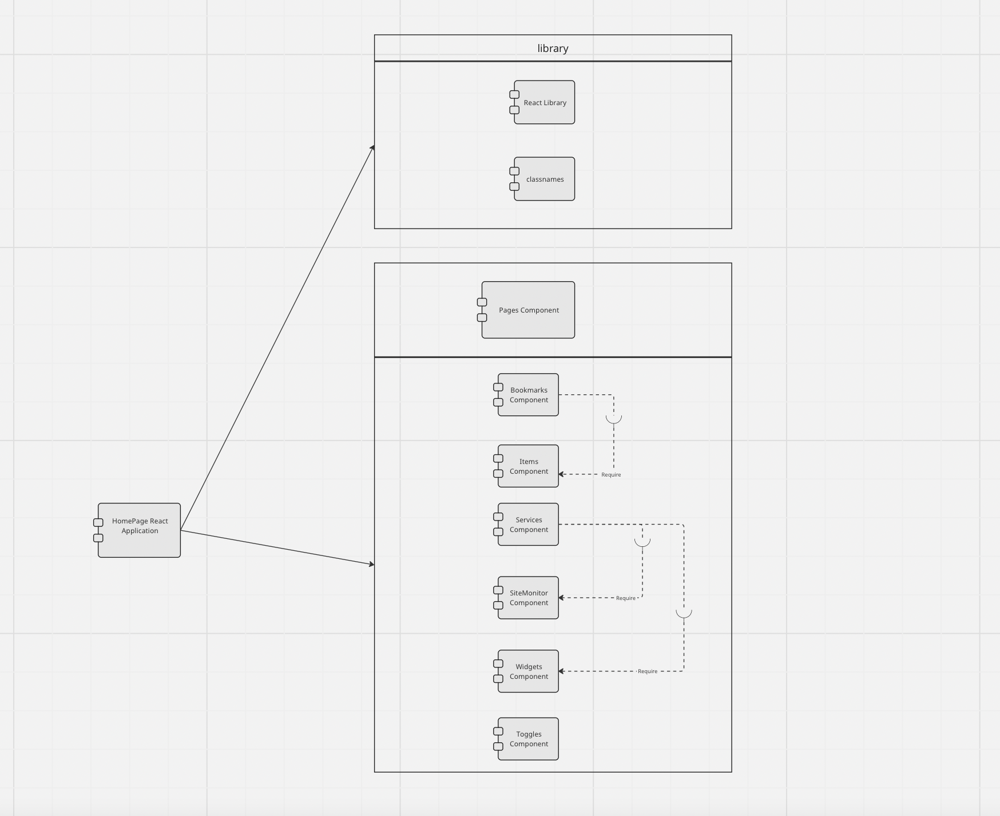

# INFO 443 AU 23 Project 2

#### Group Members
- Minh Mai
- Chun Hin Matthew So 
- Joseph Tran 
- Jerry Yan

**Forked Repo:** [Link](https://github.com/jknt27/homepage)

**Documentation:** [Link](https://gethomepage.dev/)

## I. About the Project/Context and Background

### Project Name: *HomePage*

**Authors:** shamoon and over 200 independent contributors

**Type:** React Application

### Description:

*HomePage* is a robust React Application that functions as a versatile and user-friendly dashboard. Designed to be modern, fast, and secure, it offers a centralized platform for users to customize and access a wide array of features. These features include quick search capabilities, bookmark management, and real-time weather updates. The project was initially created by shamoon, with continuous contributions from a diverse community of over 200 independent contributors, making it the feature-rich and dynamic application it is today. Whether users are looking to streamline daily tasks, stay informed about the weather, or simply organize online activities, HomePage offers a seamless and personalized experience for users of all backgrounds and interests.

## II. Development View

### System Components

The following table below provides an overview of the primary components necessary for our application. Every component is in charge of a certain task and these all come together to create a functional system. These components are described in the table below by what they do and which dependencies it uses.

| Component | Purpose | Dependencies |
| :-------: | ------- | ------------ |
| Pages | Renders the primary "HomePage" UI and displays user's desired contents. | Bookmarks, Services, Toggles, Widgets|
| Bookmarks | Allows users to set frequently used applications and links for quick access. They may view items as groups or as a list. | Items |
| Items | An individual piece of data or statistical information that is accessible by the user. | None |
| Services | Allows user to monitor various services of their choice. This could vary from monitoring their desired server's statistics or checking the staus of their docker containers. | SiteMonitor, Widget |
| SiteMonitor | Acts similar to a `ping` command and checks the status of a server or site. | None |
| Toggles | These are similar to buttons that take the input of the user. This component changes the UI of the application based on the interaction with the user. There is a toggle for theme color, light and dark mode, and to reload the page. | None |
| Widgets | Displays information regarding current status of a desired system or basic information (such as time) | None|

*Table 1: Component Table with their purposes and dependecies.*

### UML Component Diagram

A UML component diagram for HomePage Application

[Figure 1: UML Component Diagram](https://miro.com/app/board/uXjVNNIpxuk=/?share_link_id=448532148778)

### System Dependencies

### High-Level Codeline Model

### Testing and Configuration

This repository contains no forms of testing, whether automated or unit tests. As a result, we couldn't test their code unless we wrote our own.

## III. Applied Perspective

### Introduction to Perspective

### Concerns with this Perspective

### Perspective Activities

## IV. Identify Styles & Patterns Used

### Architectural Style

All the components and modules are grouped together and layered by similar functionality. HomePage uses a Model-View-Controller (MVC) architectural style for their implementation. We can see this within the implemenation of the pages components. The model, `index.jsx`, is responsible for managing all the relevant data needed to run HomePage. `_app.jsx` is the View Layer as it is responsible for rendering all of the UI within the HomePage. The controller is made up of many `API` components which are responsible for managing user requests and updating the state of every item used.

### Software Design Patterns

[4 or more OOP patterns]

Observer Pattern - One-to-many dependency between objects. When one object changes state, all it its dependencies are notified and updated. Can be found at ``.

## V. Architectural Assessment

### Design Principles

In the realm of software architecture, adhering to key design principles is crucial for creating a robust, scalable, and maintainable system. This section evaluates how the HomePage application aligns with three fundamental principles: the Single Responsibility Principle, Open/Closed Principle, Liskov Substitution Principle, and Principle of Least Privilege.

#### Single Responsibility Principle

The Single Responsibility Principle dictates that a component should have one, and only one, reason to change, signifying that it should have only one job. In the HomePage application, this principle is effectively implemented. The bookmarks component, for instance, systematically segregates tasks into items, lists, and groups, ensuring distinct responsibilities for each sub-task. This approach enhances the scalability and maintainability of the HomePage application by simplifying the complexity of the code architecture.

#### Open/Closed Principle (OCP)

The Open/Closed Principle states that software entities should be open for extension but closed for modification. This principle is embodied in the HomePage application through its modular design, which allows for the integration of new services or features without altering the existing codebase. The application's ability to add new APIs or services through configuration files or Docker labels, without needing to modify the core application logic, is a testament to its adherence to the OCP, resulting in a more robust and adaptable architecture.

#### Liskov Substitution Principle (LSP)

The Liskov Substitution Principle mandates that objects of a superclass should be replaceable with objects of its subclasses without affecting the functionality of the application. HomePage's architecture demonstrates this principle through its effective use of polymorphism and inheritance. The application ensures that components and their derived classes are interchangeable, like seamlessly substituting a basic widget with an advanced one that offers additional features but shares the same interface. This approach not only ensures the integrity of the application's functionality but also enhances its flexibility and extensibility.

#### Principle of Least Privilege (PoLP)

The Principle of Least Privilege advocates for minimal user profile privileges based on job necessities. In HomePage, this is reflected in the security design where all API requests to backend services are proxied, keeping API keys hidden and ensuring minimal exposure. This principle is critical for enhancing the application's security, as it restricts access rights for users to the bare minimum necessary to perform their tasks, thereby reducing the attack surface and potential damage from accidents or malicious actions

## VI. System Improvement
