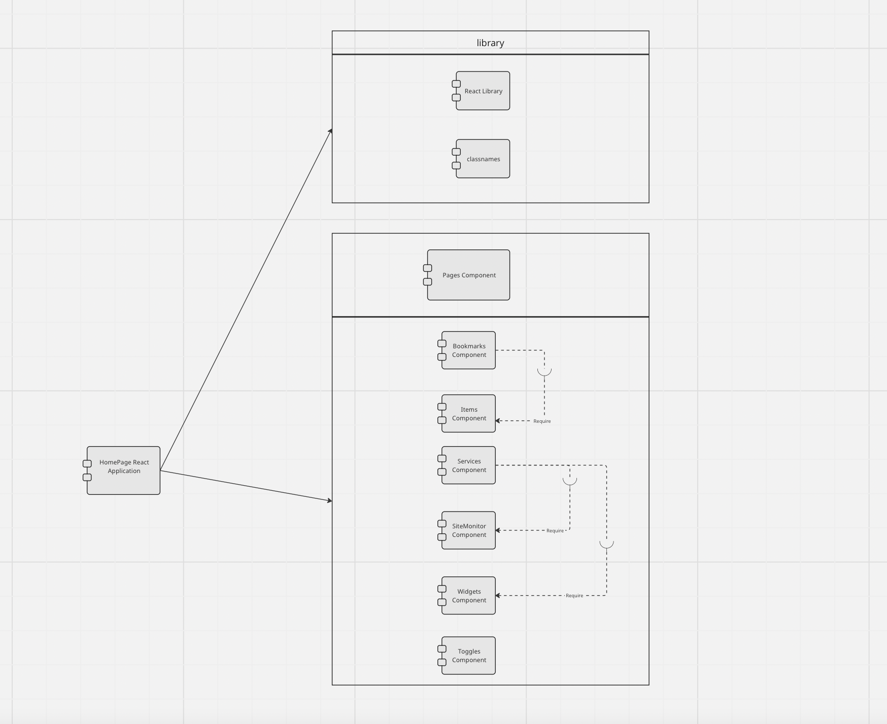

# INFO 443 AU 23 Project 2

#### Group Members
- Minh Mai
- Chun Hin Matthew So 
- Joseph Tran 
- Jerry Yan

**Forked Repo:** [Link](https://github.com/jknt27/homepage)

**Documentation:** [Link](https://gethomepage.dev/)

## I. About the Project/Context and Background

### Project Name: *HomePage*

**Authors:** shamoon and over 200 independent contributors

**Type:** React Application

### Description:

*HomePage* is a robust Next.js application, leveraging technologies like React, Docker, and Node.js. It functions as a versatile dashboard, blending React's UI capabilities with Next.js's efficiency, enhanced by Docker and Node.js for robust backend support. Designed to be modern, fast, and secure, it offers a centralized platform for users to customize and access a wide array of features. These features include quick search capabilities, bookmark management, and real-time weather updates. The project was initially created by shamoon, with continuous contributions from a diverse community of over 200 independent contributors, making it the feature-rich and dynamic application it is today. Whether users are looking to streamline daily tasks, stay informed about the weather, or simply organize online activities, HomePage offers a seamless and personalized experience for users of all backgrounds and interests.

## II. Development View

### System Components

The following table below provides an overview of the primary components necessary for our application. Every component is in charge of a certain task and these all come together to create a functional system. These components are described in the table below by what they do and which dependencies it uses.

| Component | Purpose | Dependencies |
| :-------: | ------- | ------------ |
| Pages | Renders the primary "HomePage" UI and displays user's desired contents. | Bookmarks, Services, Toggles, Widgets|
| Bookmarks | Allows users to set frequently used applications and links for quick access. They may view items as groups or as a list. | Items |
| Items | An individual piece of data or statistical information that is accessible by the user. | None |
| Services | Allows user to monitor various services of their choice. This could vary from monitoring their desired server's statistics or checking the staus of their docker containers. | SiteMonitor, Widget |
| SiteMonitor | Acts similar to a `ping` command and checks the status of a server or site. | None |
| Toggles | These are similar to buttons that take the input of the user. This component changes the UI of the application based on the interaction with the user. There is a toggle for theme color, light and dark mode, and to reload the page. | None |
| Widgets | Displays information regarding current status of a desired system or basic information (such as time) | None|

*Table 1: Component Table with their purposes and dependecies.*

### UML Component Diagram

In the constructed UML component diagram for the HomePage React Application below, a hierarchical decomposition of system components is presented, epitomizing a modular architecture and encapsulation. The apex of this hierarchy is the HomePage application itself, which delineates into two principal components: the 'Library' and the 'Pages Component'.

The 'Library' serves as a foundational tier, encapsulating the React Library alongside the 'classnames' utility, indicating a reliance on React's component-driven architecture and dynamic styling capabilities for UI construction and manipulation.

Within the 'Pages Component', a composite structure unfolds, comprising 'Bookmarks', 'Items', 'Services', 'Site Monitor', 'Widgets', and 'Toggles' components. This layered approach manifests a clear dependency management strategy, where 'Bookmarks' requisition 'Items' for data representation, and 'Services' necessitate 'Site Monitor' and 'Widgets' for functionality. This delineation underscores an architecture where high-level components are abstracted from low-level operations, fostering an environment conducive to independent component development and testing, as well as scalability through facile integration of additional features. The diagram thus reflects a contemporary approach to React development, privileging component reusability and compositionality.

*Figure 1: UML Component Diagram illustrating the modular structure and inter-component relationships within the HomePage React Application.*

### System Dependencies

### High-Level Codeline Model

[Link to the Diagram](https://miro.com/app/board/uXjVNEo28zk=/?share_link_id=220470306222)

The `component` folder defined by the `src` folder is the main repository that contains the most important code for the HomePage Application. Inside the `component` folder, it is divided into four main components: bookmark item, service, widget, and toggle, which all of them act an essential role in ensuring the proper execution of the HomePage application. 

### Testing and Configuration

This repository contains no forms of testing, whether automated or unit tests. As a result, we couldn't test their code unless we wrote our own.

## III. Applied Perspective

### Introduction to Perspective

Usability as an architectural perspective emphasizes designing systems that are efficient, effective, and satisfying for the end user. It focuses on how user interactions with the system are designed and how easily users can accomplish their desired tasks. In a usability-focused architecture, the primary goal is to create a system that is intuitive, easy to navigate, and accessible to a diverse range of users. This perspective is crucial in ensuring that the system is not only functional but also user-friendly and engaging.

### Concerns with this Perspective

When adopting a usability perspective, several key concerns must be addressed:

User Experience Design: Ensuring the system is intuitive, easy to learn, and pleasant to use. It involves understanding the users' needs, behaviors, and frustrations.

Accessibility: Making the system usable for people with a wide range of abilities. This includes considering users with disabilities and ensuring compliance with accessibility standards.

User Interface Design: Focusing on the aesthetics and layout of the system. The interface should be clear, responsive, and visually appealing.

Feedback and Error Handling: Providing clear, helpful feedback to users, especially in error situations. The system should guide users in correcting mistakes and understanding how to use it effectively.

Performance and Efficiency: Ensuring the system responds quickly to user input and operates smoothly, enhancing the overall user experience.

### Perspective Activities

In applying a usability perspective, the process begins with understanding the users. This means finding out what they need and prefer through surveys and studies. The information gathered is then used to create several versions of the design, which are improved over time. This improvement comes from testing the system with real users, where feedback is collected to identify what works well and what doesn’t.

At the same time, it's important to make sure the system is easy for everyone to use, including people with disabilities. This is done through accessibility checks. The system’s speed and responsiveness are also continuously checked and improved to make sure it works smoothly and quickly.

Finally, user feedback is an ongoing part of the process. It helps to tweak and enhance the system regularly. To help users get the most out of the system, clear instructions and training materials are provided. All these steps together make sure the system is not just functional but also easy and enjoyable to use.

## IV. Identify Styles & Patterns Used

### Architectural Style

The HomePage application, developed using Next.js, embraces a hybrid architectural style that combines elements of both Server-Side Rendering (SSR) and Static Site Generation (SSG), which are characteristic of Next.js applications. While the Model-View-Controller (MVC) pattern is partially applicable, Next.js's unique architecture calls for a distinct approach. In this setup, the 'pages' directory housing `.jsx` files functions as the View layer, responsible for rendering the user interface. Instead of a separate 'model' layer, data management and state updates are integrated into these page components and API routes. The API routes located in the 'pages/api' directory assume a role similar to that of the Controller layer, handling data flow and user requests. This structure highlights Next.js's adaptability in terms of rendering and data handling strategies.

Furthermore, HomePage's components and modules are thoughtfully organized and structured according to their shared functionality. The implementation of the MVC architectural style is evident in the page components. The `index.jsx` file serves as the model, responsible for managing all the essential data required for HomePage's operation. On the other hand, `_app.jsx` takes on the role of the View Layer, responsible for rendering the entire user interface within the HomePage. The controller aspect is composed of multiple 'API' components, which efficiently manage user requests and facilitate updates to the application's state. This well-structured approach enhances the maintainability and clarity of HomePage's codebase.

### Software Design Patterns

The HomePage application demonstrates the use of several Object-Oriented Programming (OOP) design patterns:

#### __1. Observer Pattern__

The Observer Pattern is a behavioral design pattern that defines one-to-many relationships between dependency and object so that all dependents are updated when one object changes its state. In the HomePage applications, the item component in `src/components/services/item.jsx`, which are responsible for showing the item on the Homepage can be beneficial by using observer design pattern. The problem can be that multiple parts of the application need to be updated if there is a change in the information provided by the Items. Observer pattern could be seen in the code where `statsOpen`, `statsClosing`, and `SiteMonitor` as the observer to notify of any changes in the item state.

#### __2. Strategy Pattern__

 The Strategy Design pattern is a design pattern that encapsulates similar algorithms to enable the component to be interchangeable. In the HomePage application, the toggle (`src/components/toggles`) handles user interactions that influence the user interface, such as toggling between light and dark mode, changing theme colors, and reloading the page. The problem is that different users might have different preferences for how they want the homepage to look. The Strategy pattern could be used to address this problem. Instead of hardcoding the user interface behavior within the `toggles` component, the application can define a family of monitoring algorithms (strategies) encapsulated in separate classes. Each strategy class implements a specific way to change the user interface.

#### __3. Decorator Pattern__

The Decorator Pattern is a structural design pattern that provides flexibility for subclass to expand functionality by adding additional functions to an object. In the HomePage application, the group from the bookmarks component can be beneficial from the Decorator pattern. The purpose of this usage is to extend the functionality of the bookmark component without modifying its core code, which is item code. Inside the group, conditional rendering (layout?.header !== false) can also be considered as decorators to allow for the dynamic application of CSS classes based on certain conditions. Besides, the `beforeLeave` and `beforeEnter` functions inside the transition component can also act as decorators to customize the transition behavior, providing additional animation effects.

#### __4. Composite Pattern__

The Composite Pattern is a structural design pattern that treats individual objects the same as compositions of objects. In the HomePage application the weather from the widget component can be beneficial from the composite design pattern. The purpose of this pattern is to let the client use the same interface components to expand scalability and maintainability. Inside the `weather.jsx`, the weather api function acts as a composite to contains composites such as ContainerButton and widget to be treated the same by the client through sharing a common interface

#### __5. Factory Method Pattern__

The Factory Method design pattern is utilized in the creation of widgets within the HomePage application. This pattern is specifically used in the context of rendering widgets dynamically based on the `widget.type` property. The problem it addresses is the need to create various types of widgets without altering the core Widget component. To solve this, the Factory Method pattern is employed by utilizing a `widgetMappings` object, which acts as a factory, mapping widget types to their respective component constructors. By doing so, it achieves the goal of being "open for extension but closed for modification," ensuring that the core Widget component remains unchanged while allowing for the creation of specific widget instances as needed. This approach enhances the overall flexibility and maintainability of the application's codebase. Moreover, it simplifies the process of adding new widgets to the application, promoting code reusability and centralizing the creation logic in a structured mapping. 

## V. Architectural Assessment

### Design Principles

In the realm of software architecture, adhering to key design principles is crucial for creating a robust, scalable, and maintainable system. This section evaluates how the HomePage application aligns with five fundamental principles: the Single Responsibility Principle, Open/Closed Principle, Liskov Substitution Principle, Principle of Least Privilege, and Interface Segregation Principle.

#### __1. Single Responsibility Principle (SRP)__

The Single Responsibility Principle asserts that a component should have a singular reason to change, indicating a sole responsibility. The HomePage application adeptly adheres to this principle. Notably, the bookmarks component is meticulously structured into items, lists, and groups, with each segment undertaking a distinct task. This clear delineation of responsibilities augments both the scalability and the maintainability of the HomePage application by reducing the complexity inherent in the code architecture.

_Supporting trends_: The `BookmarksGroup` component in the HomePage application exemplifies the Single Responsibility Principle (SRP) by focusing solely on rendering bookmark groups. It achieves this by delegating specific tasks to sub-components like `List` and `ResolvedIcon`, maintaining a clear and singular focus. This approach not only simplifies the component but also enhances the overall structure and maintainability of the codebase, aligning well with SRP's core tenet of having a single reason for change.

_Violating trends_: Despite its strong adherence to SRP in many aspects, the `BookmarksGroup` component shows potential deviations from SRP by intertwining UI rendering with detailed styling and interaction logic. The handling of both the visual presentation and dynamic behavior within the same component could be seen as encompassing multiple responsibilities. This mix, although practical in front-end development, suggests areas where responsibilities could be more distinctly separated to fully align with the strict interpretation of SRP.

#### __2. Open/Closed Principle (OCP)__

The Open/Closed Principle posits that software entities should be amenable to extension but resistant to modification. This principle finds embodiment in the HomePage application's modular design, which facilitates the integration of new services or features without necessitating alterations to the existing codebase. The capacity of the application to incorporate new APIs or services via configuration files or Docker labels, while preserving the integrity of the core application logic, exemplifies its commitment to the OCP, thereby enhancing the system's robustness and adaptability.

_Supporting trends_: The `Item` component demonstrates adherence to the Open/Closed Principle through its use of external components and contexts. By utilizing `SettingsContext` and `ResolvedIcon`, the component is designed to be open for extension but closed for modification. The `SettingsContext` allows for dynamic configuration without altering the internal structure of the Item component, accommodating varying settings for how items are displayed or behave. Similarly, `ResolvedIcon` provides flexibility in rendering different icons, enabling the extension of icon types without modifying the Item component itself. This modular design, where functionality can be extended via external contexts and components, aligns well with the OCP’s principles.

_Violating trends_: On the potential violation side, the `Item` component directly manages several specific UI details, such as layout and styling. The inline styling and layout configurations within the component might hinder its adherence to OCP if these aspects require frequent modifications for different use cases. For better alignment with OCP, such design elements could be abstracted into separate, configurable modules or components. This abstraction would allow for varying styles or layouts without necessitating changes to the `Item` component's core structure, thus maintaining its closure to modification while being open to extension through external configurations or styling components.

#### __3. Liskov Substitution Principle (LSP)__

The Liskov Substitution Principle mandates that objects of a superclass should be seamlessly replaceable with objects of its subclasses without impinging on the application’s functionality. HomePage's architecture illustrates this principle through a proficient application of polymorphism and inheritance. The system ensures that various components and their derivatives are interchangeable, such as the substitution of a basic widget with a more advanced variant offering additional features while maintaining a consistent interface. This strategy not only preserves the application’s functional integrity but also bolsters its flexibility and extensibility.

_Supporting trends_: The `BookmarksGroup` component, as a React component, inherently supports the Liskov Substitution Principle (LSP) through its composability. When used in contexts where a generic component is expected and it fulfills that role without disrupting functionality, it aligns with LSP. React's component model promotes interchangeability based on expected props and outputs, reinforcing LSP principles. Additionally, the component relies on other components like List and `ResolvedIcon`. If these components adhere to LSP by being replaceable or extensible without affecting `BookmarksGroup`, it strengthens the LSP support in the architecture.

_Violating trends_: Explicit violations of LSP are not evident in the provided `BookmarksGroup` component snippet, as LSP primarily concerns class inheritance and subclassing, which are not present. However, potential violations may arise if `BookmarksGroup` deviates from expected prop contracts when used as a replacement for another component. Any unexpected behavior or side effects when substituting `BookmarksGroup` in various contexts could also indicate a breach of LSP, suggesting that further analysis is needed to assess its compliance with the principle.

#### __4. Principle of Least Privilege (PoLP)__

The Principle of Least Privilege advocates for the minimal allocation of user privileges, strictly as per job necessities. HomePage's architecture reflects this principle in its security design, wherein all API requests to backend services are proxied, thereby concealing API keys and minimizing exposure. This approach is instrumental in fortifying the application’s security, as it constrains user access rights to the absolute minimum required for task performance, thus mitigating the risk of security breaches or accidental mishaps.

_Supporting trends_: The API endpoints effectively support PoLP through its implementation of environment variable substitution, clean organization of service groups, and role-based service merging. By substituting sensitive information like API keys with environment variables, the code ensures that critical data remains hidden and secure. The clean organization of service groups from various sources, such as Docker and Kubernetes, demonstrates an effort to include only relevant services, reducing the potential attack surface. Additionally, the role-based merging of services consolidates privileges, aligning with PoLP principles by granting services the minimum access they need.

_Violating trends_: Despite the positive aspects, there are potential violations of PoLP in the API endpoints. The code's error handling, while informative, could inadvertently expose sensitive information in error messages, which should be handled more securely to avoid potential risks. Additionally, the code's access to configuration settings lacks granularity, potentially providing access to settings beyond what components require. Further, the code's discovery of Docker and Kubernetes services could benefit from role-based access control to ensure that services are only accessible by components with a legitimate need. These areas present opportunities for improvement to better align with the Principle of Least Privilege and enhance overall system security.

#### __5. Interface Segregation Principle (ISP)__

The Interface Segregation Principle advises against obligating clients to depend on interfaces that they do not use. HomePage's modular design, which encompasses distinct components like bookmarks, items, services, etc., demonstrates compliance with the ISP. Each component delivers a specific functionality, ensuring that clients – be they users or other system components – interact exclusively with the elements pertinent to their needs. This alignment with the ISP significantly enhances both the usability and the maintainability of the system.

_Supporting trends_: In the codebase, the Interface Segregation Principle (ISP) is supported by a modular and well-structured design. Each interface defines a specific set of methods that are relevant to the classes implementing them. This focused approach ensures that classes only need to implement the methods they require, avoiding unnecessary dependencies. For example, interfaces used for service communication have minimal, purpose-driven methods, allowing service classes to implement only what's necessary for their functionality. This adherence to ISP enhances code maintainability and reduces the risk of unintended side effects when modifying or extending classes.

_Violating trends_: On the other hand, there are instances in the codebase where ISP is potentially violated. Some interfaces contain a large number of methods, and certain classes implementing these interfaces do not use all of them. This can lead to classes being forced to provide empty or meaningless implementations for unused methods. For instance, an interface intended for communication with external services includes methods for various functionalities, but some concrete service classes only utilize a subset of these methods. This violation of ISP can introduce unnecessary complexity and maintenance challenges, as classes are burdened with implementing methods that have no relevance to their core functionality. It's important to review and refactor these interfaces to adhere more closely to ISP principles and improve code clarity.

## VI. System Improvement

### Refactoring Code

In the Home Page application's source code, we've identified opportunities for code refactoring that can significantly enhance clarity, maintainability, and collaboration among developers.

#### __1. homepage/src/components/services/site-monitor.jsx__

The `Site monitor`, `site-monitor.jsx`, from the `service` component is responsible for tracking the availability of the URL and displaying the delayed response time, which is integral for the proper execution of the Home Page application. However, there is some refactoring improvement to be made to improve its clarity, maintainability,and collaboration between programmers. Inside the `Site monitor` code -  `site-monitor.jsx`, the `t` in line 5 from `const { t } = useTranslation();` should be renamed as translation for better clarity. Also, the use of '403' from `if (data.status > 403)` may appear as a magic number to non-website programmer. Therefore, it should do a constant value of `const FORBIDDEN_STATUS_CODE = 403;`. Other than that, the site monitor should consolidate conditional expression and Replace Nested Conditional with Guard Clauses as defined by Martin. Inside the site monitor, there are too many if statements from line 15 to line 52, thus increasing the complexity for other programmers to understand and maintain the quality of code. Those if statements can be consolidated into a function and break down into several if statements according to the Replace Nested Conditional with Guard Clauses to return the value back to the export function to uphold the maintainability and readability.

#### __2. homepage/src/components/bookmarks/group.jsx__

The refactored code enhances the readability and maintainability of the original code while preserving its functionality. It introduces a state variable, `isOpen`, and a `togglePanel` function to manage the open/closed state of the panel, improving the code's clarity. Conditional classes, such as `toggleButtonDisabled`, `transitionClass`, and `toggleButtonIconClass`, are used to make classNames more readable and eliminate redundant calculations. The event handling for toggling the panel is now handled within the `Disclosure.Button`, following a standard practice. Overall, these refactoring changes streamline the code structure and formatting, resulting in a more organized and understandable component for managing bookmark groups with collapsible panels.
